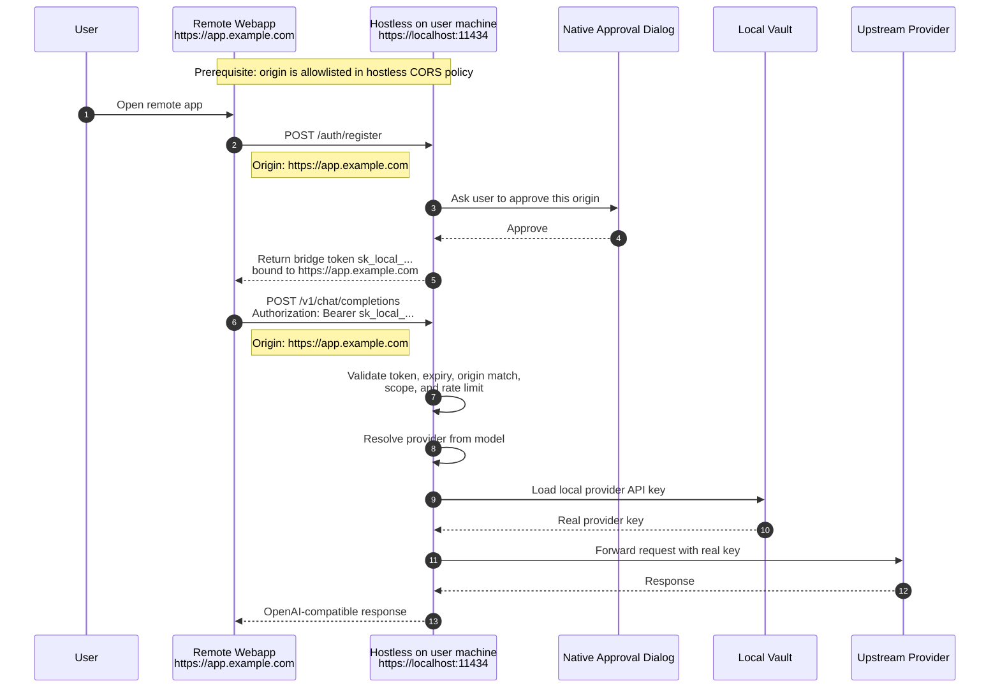
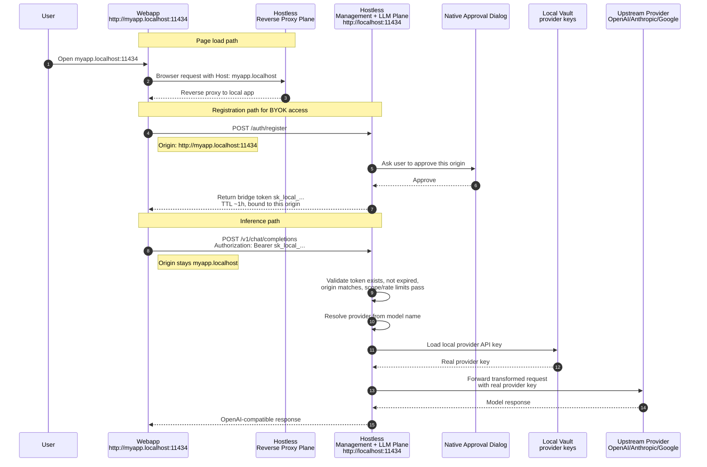

I’m gathering the hostless auth and routing context first so the diagram matches the actual BYOK flow rather than guessing from the surface docs.

## Remote webapp BYOK flow

This is the remote-origin browser flow, where the app is hosted somewhere like `https://app.example.com` and talks to the user’s local hostless instance:

The two extra constraints for a remote webapp are:

- The remote origin must be explicitly allowlisted first, for example with `hostless origins add https://app.example.com`, or the browser will fail on CORS before registration.
- If the remote app is served over HTTPS, it should call `https://localhost:11434`, not `http://localhost:11434`, or the browser may block it as mixed content.

If you want, I can also show the same remote flow as a combined architecture diagram with CORS, token binding, and provider-key boundaries called out visually.

## Local webapp BYOK flow

Here’s the simplest accurate mental model: the webapp never gets the real OpenAI/Anthropic/Google key. It gets an origin-bound bridge token, and hostless uses that token to decide whether it may spend the locally stored provider key on the app’s behalf.

The key boundary is this:

- `myapp.localhost` traffic goes through the reverse-proxy plane so each app gets its own browser origin.
- `localhost:11434/auth/*` and `localhost:11434/v1/*` live on the management/LLM plane.
- The bridge token is what crosses into the browser. The provider API key stays inside hostless.

One subtle but important detail: `.localhost` subdomains are not just a convenience URL. They are the security boundary that prevents one local app from reusing another app’s token. That behavior is defined by the host dispatch layer in dispatch.rs, the token validation middleware in middleware.rs, and the registration/proxy handlers in routes.rs.

If you want, I can also give you:
1. a simpler architecture diagram instead of a sequence diagram
2. a version you can paste directly into your README/docs with brief captions
3. a second Mermaid diagram showing the security boundary between `.localhost` and bare `localhost`

## Connecting to hostless

A local webapp does not need CLI registration to get a bridge token. It can call `POST /auth/register` directly from the browser and receive a token that is bound to its `.localhost` origin. CLI or a native helper becomes useful when you want to provision the route and token automatically before the browser app starts, or when the caller is a remote webapp that cannot safely do localhost management/CORS setup itself.

For a remote webapp, your “custom URL scheme + control-panel/native app” framing is the right shape. The native helper owns the privileged local steps:
- ensure hostless is running and discover its port
- ensure the remote origin is allowlisted
- call `POST /auth/register` on the user’s local hostless
- return the bridge token to the remote app

On your questions:

1. Yes, the remote flow can work very much like OAuth. Hostless already supports that pattern. The handler can call `POST /auth/register` with a `callback` and `state`, and hostless will redirect to the callback with:
- `state` echoed back
- `port` and `local_url` in the query string
- the bridge token in the URL fragment as `#token=...`

That is explicitly designed to avoid putting the token in the query string. So the flow is basically:
1. remote site launches `hostless:` custom URL
2. native helper talks to local hostless
3. local hostless approves and issues token
4. local hostless redirects back to the remote app callback
5. remote app reads the fragment client-side and stores the bridge token

That contract is described in docs/auth-and-security.md and implemented in src/server/routes.rs.

2. For a local webapp, the normal browser path is not “POST to the new localhost subdomain.” The auth and LLM endpoints live on bare `localhost`, not on `myapp.localhost`. The app page can be served from `http://myapp.localhost:11434`, but it should call bare hostless endpoints such as:
- `POST http://localhost:11434/auth/register`
- later `POST http://localhost:11434/v1/chat/completions`

Because the browser sends `Origin: http://myapp.localhost:11434`, hostless can bind the issued token to that app origin. That is the clean local-browser handshake.

There is also a second local bootstrap path for managed apps:
- a local CLI/process registers the app route with `POST /routes/register`
- if `auto_token: true`, hostless returns a token already scoped to `http://myapp.localhost:11434`

That path is more “app launcher / dev tooling / CLI integration” than “browser self-registration.”

The practical split is:

- Remote webapp:
Needs a native helper or control-panel app to bridge into local privileged operations. OAuth-style callback is the right return mechanism.

- Local `.localhost` webapp:
Can self-register directly in-browser via `POST /auth/register`, or be pre-provisioned by CLI/process tooling via `/routes/register` with `auto_token`.

If you want, I can turn this into two concrete sequence diagrams:
1. remote webapp + custom URL scheme + callback
2. local `.localhost` webapp direct registration flow

===

Not quite: the `hostless:` URL scheme hop is not itself an HTTP request. It is an OS-level app launch. The native handler app receives a URL like `hostless://...`, parses it, and then makes a normal HTTP request to the local hostless daemon.

From there, yes: the local HTTP part can use normal redirect semantics. In hostless today, `POST /auth/register` supports a `callback` field, and if present it responds with `303 See Other` to that callback URL, putting:
- `state`, `port`, and `local_url` in the query string
- the bridge token in the URL fragment as `#token=...`

That behavior is implemented in src/server/routes.rs and described in docs/auth-and-security.md.

So the shape is:

1. Remote site opens `hostless:...`
2. Native handler launches
3. Native handler calls local `POST /auth/register`
4. Hostless returns a redirect to `https://app.example.com/callback?...#token=sk_local_...`
5. Native handler opens that URL in the browser
6. Remote app reads `window.location.hash` and extracts the token

That is similar to old OAuth implicit flow, where the access token is returned in the fragment so it does not hit server logs or intermediaries. It is not how modern OAuth is usually done now. Modern OAuth prefers authorization code + PKCE, where the browser gets a short-lived code and exchanges it for a token server-side or in a PKCE-secured client flow.

So the precise answer is:

- Yes, the native helper can use ordinary HTTP + redirect behavior once it talks to local hostless.
- Yes, returning the token in `#token=...` to the callback URL is a valid OAuth-like pattern.
- No, that is not the modern recommended OAuth pattern; it is closer to the older implicit-style return flow.

If you want the cleanest analogy for docs, say:

“Hostless remote app bootstrap uses an OAuth-like callback flow: a native `hostless:` handler calls local hostless, then returns the origin-bound bridge token to the webapp via a callback URL fragment.”

If you want stronger security than fragment delivery, the next design step would be a one-time code flow:
1. local hostless redirects with `?code=...&state=...`
2. remote app sends the code to its backend
3. backend or helper exchanges it for the bridge token

That would be more modern, but it is not the current hostless behavior.

===

Yes. If the native `hostless:` handler simply opens the callback URL with the OS, you get exactly those problems:

- it may open a second tab or window
- it may open in the system default browser instead of the browser/profile where the user started
- it can lose the original tab context entirely

That is the weak point of a naive fragment-based callback design. It is workable, but the UX is brittle.

OAuth-native apps run into the same class of problem. Modern flows avoid it by using patterns like:
- loopback redirect to a localhost listener owned by the app
- claimed HTTPS redirect URIs that the app can intercept
- app-managed browser sessions

For a remote hostless webapp, the better pattern is usually not “native app opens callback URL directly.” The better pattern is:

1. The webapp starts a connect session on its own backend and gets a one-time `state` or `session_id`.
2. The page launches `hostless:` with that state.
3. The native helper talks to local hostless and gets the bridge token.
4. The native helper sends the result to the webapp backend, keyed by that state.
5. The already-open browser tab polls, uses SSE, or uses WebSocket to learn that the session completed.

That avoids:
- extra tabs
- wrong-browser issues
- wrong-profile issues
- dependence on URL fragments for delivery

So your concern is correct: a direct callback URL is conceptually simple, but it is not the strongest UX design for remote webapps.

For local webapps on `.localhost`, this problem mostly disappears because the browser page can just call local hostless directly and receive JSON back in the same tab.

If you want, I can sketch the recommended remote flow as a Mermaid diagram using “state + backend polling” instead of “open callback URL in browser.”

===

A local webapp does not choose the subdomain at registration time. That part must already exist before the browser app loads.

The sequence is:

1. Something local provisions the route first.
   Examples: `hostless run`, `hostless route ...`, or `POST /routes/register`.
2. Hostless assigns or confirms the app URL, for example `http://myapp.localhost:11434`.
3. The browser loads from that URL.
4. Once loaded, the app already knows its own origin from `window.location.origin`, so it can register using that exact origin.

So there are really two separate “where do I send things?” questions:

- Which subdomain is my app on?
  The app learns that simply by being loaded there. If the page is open at `http://myapp.localhost:11434`, then that is the origin to register.

- Which hostless endpoint do I call for registration?
  The app should call bare localhost on the same hostless port, not its own subdomain. In practice:
  - current page origin: `http://myapp.localhost:11434`
  - registration endpoint: `http://localhost:11434/auth/register`

From the page, that is usually derivable as:
- origin to register: `window.location.origin`
- hostless port: `window.location.port`
- registration URL: `http://localhost:${window.location.port}/auth/register`

What the app should not do is send registration to `myapp.localhost/auth/register`, because `.localhost` subdomain traffic is the reverse-proxy plane, not the management/auth plane. That boundary is defined in src/server/dispatch.rs and the registration handler is in src/server/routes.rs.

The one caveat is this: if the app is not already running behind a hostless-managed `.localhost` route, then it cannot infer a hostless subdomain by itself. In that case, a local launcher or CLI step must register the route first and tell the app where it lives. The route registration response includes the assigned URL and can also auto-provision a token, as shown in docs/reverse-proxy.md.

The practical rule is:

- Local browser app already loaded on `*.localhost`:
  It can self-register by reading `window.location.origin` and calling bare `localhost:<same-port>/auth/register`.

- Local app not yet loaded through hostless:
  A local tool must create the route first. The browser app cannot discover or mint its own subdomain from nothing.

If you want, I can turn that into a short “bootstrap matrix” for docs/app-integration.md covering:
1. remote webapp bootstrap
2. local `.localhost` self-registration
3. CLI/launcher pre-provisioned local app

===

Yes, they could, but it is usually the wrong tool for local `.localhost` webapps.

The distinction is about whether the browser app can already talk to local hostless directly:

- If the app is already running at something like `http://myapp.localhost:11434`, then it already has a first-party local origin and hostless already accepts `.localhost` browser origins. In that case, using `hostless:` adds an unnecessary native-app hop.
- If the app is not yet running through hostless, then a launcher/native helper could use `hostless:` as part of bootstrap, but that is really a provisioning flow, not the normal in-browser auth flow.

So for local webapps, the simpler path is:

1. App is served from `http://myapp.localhost:11434`
2. App reads `window.location.origin`
3. App calls `http://localhost:11434/auth/register`
4. Hostless returns JSON with the bridge token
5. App uses that token for `http://localhost:11434/v1/...`

That keeps everything in one tab, one browser profile, one JS runtime.

Using `hostless:` for that same case would usually make things worse:

- it jumps out of the browser into OS URL handling
- it can create extra tabs/windows
- it can land in the wrong browser/profile
- it complicates token return even though same-tab JSON was already possible

So the rule of thumb is:

- Remote webapp:
  `hostless:` is useful because the browser cannot fully bootstrap local trust and registration on its own.

- Local `.localhost` webapp:
  direct HTTP registration is better once the app is already loaded.

- Local app launcher / desktop shell / CLI-managed app:
  `hostless:` can still be useful as a bootstrap convenience before the browser app is running.

One more nuance: if you want a single integration story for both remote and local apps, you can choose to support `hostless:` everywhere. That can simplify documentation, but it raises the floor of complexity for the local case without giving much technical benefit.

If you want, I can help you write a short decision section for docs/app-integration.md that says when to use direct HTTP vs when to use `hostless:`.

===

I’m verifying the one place this can break: whether “same flow” really means the same backend operation, or only the same user-facing bootstrap handled by a native helper.

Searched for regex `hostless.port|admin.token|/routes/register|/auth/register|auto_token|callback` (`**/docs/**`), 52 results

Read 

Read , lines 1400 to 1915

I checked the actual handlers: a unified user-facing bootstrap is plausible, but it would still sit on top of two different hostless operations under the hood. I’m recording that distinction and then I’ll spell out what you gain and what you give up.

Inserted into memory file 

Yes, but with an important qualification:

You can unify the product flow for both remote and local webapps behind a single `hostless:` bootstrap, but you are not really unifying them into one identical protocol. You are unifying the UX while still dispatching to different hostless primitives underneath.

The clean way to think about it is:

- Remote webapp:
  `hostless:` helper calls `POST /auth/register` for the remote origin and returns an origin-bound token for `https://app.example.com`.

- Local webapp:
  `hostless:` helper usually needs to create the `.localhost` route first via `POST /routes/register` with `auto_token: true`, then open the browser on that `.localhost` URL with the token.

So the “same flow with minor query param differences” is true at the launch UX level, but not quite true at the daemon API level. Local bootstrap has one extra structural step: it needs a route before there is a page origin to bind to.

What you gain by unifying on `hostless:`:

- One mental model for apps: “launch `hostless:` and wait for ready”
- One native helper for daemon discovery, origin setup, and token minting
- No need for local webapps to know hostless port details in browser JS
- Better first-run bootstrap for local apps, because the helper can provision route + token before opening the page

What you lose:

- You give up the simplest local path.
  A `.localhost` app can already do direct browser `POST /auth/register` with no native helper. A unified `hostless:` flow adds native complexity where none was required.

- You add a hard dependency on a native helper.
  Local browser apps that could have worked with “just hostless + browser” now require OS URL scheme installation and helper lifecycle management.

- Local bootstrap now needs privileged local operations.
  `POST /routes/register` is management-gated and requires local admin auth, so the helper must read and send the admin token from the user’s machine.

- Browser handoff gets more complicated.
  If the helper opens URLs, you inherit the wrong-browser / wrong-profile / extra-tab problems unless you use a backend session handoff instead of naive callback redirects.

- The local and remote security stories diverge under the surface.
  Remote token is bound to the remote HTTPS origin.
  Local token is usually bound to the generated `.localhost` origin.
  That means the helper still needs different logic even if the entrypoint URL looks unified.

- Recovery and reconnect flows get harder.
  With direct local browser registration, the page can just re-register or refresh in place.
  With helper-mediated bootstrap, refresh/reconnect may need session persistence or another round-trip through the helper.

So my recommendation is:

- If you want the cleanest architecture, keep two modes:
  - remote webapps use `hostless:`
  - local `.localhost` webapps can use either direct HTTP or `hostless:`

- If you want the cleanest product story, standardize on `hostless:` for both, but accept that:
  - local mode is no longer the minimum-complexity path
  - the helper becomes part of the core product, not just an optional bridge

The sharpest summary is:

A single `hostless:` bootstrap can unify onboarding, but it does not actually erase the difference between “bind a remote origin” and “create a local route plus token.” What you lose is the simplicity and browser-native nature of the local `.localhost` flow.

If you want, I can next lay this out as a short decision table for docs/app-integration.md with columns for `Remote`, `Local direct`, and `Local via hostless:`.

===

I’m mapping that mixed deployment case into one decision tree, because the right answer is not two separate buttons but one bootstrap strategy with origin-aware branching.

Inserted into memory file 

That is the exact case where you want one button and two underlying paths.

The button should be a single product surface, `Connect to hostless`, but the client should choose the bootstrap path based on where the app is currently running.

Recommended decision rule:

1. If the page origin is a `.localhost` hostless origin, use direct browser registration.
2. Otherwise, use the `hostless:` native-helper flow.

In practice:

- Hosted app at `https://app.example.com`
  Clicking the button launches the remote bootstrap flow through `hostless:`.

- Locally cloned app running through hostless at `http://myapp.localhost:<port>`
  Clicking the same button can directly call local hostless over HTTP and get JSON back in the same tab.

This gives you one UX and avoids forcing the local clone through the more fragile native-hop flow when it already has a clean browser-native path.

A good runtime policy is:

- Detect local-hostless mode by checking whether `window.location.hostname` ends with `.localhost`.
- If yes:
  call `http://localhost:${window.location.port}/auth/register` with `origin = window.location.origin`
- If no:
  launch `hostless:` with a `state/session_id`, and let the native helper complete the remote bootstrap

What you gain with this hybrid approach:

- One button in the UI
- Best UX for both environments
- No hard dependency on `hostless:` for local clones
- No extra tab/default-browser problems for the local case

What you avoid losing:

- You keep the simple same-tab local registration flow
- You still support hosted usage where a native helper is necessary

What not to do:

- Do not force both hosted and local clones through `hostless:` unless you explicitly want a single native-dependent architecture.
- Do not try to make the hosted web app directly mimic the local `.localhost` flow in-browser; remote origins still have the CORS/local-trust problem.

So the clean product answer is:

“One button, environment-aware branching.”

If you want an even cleaner implementation story, the button can try local-direct first, then fall back:

1. If current origin is `.localhost`, try direct `POST /auth/register`
2. If that fails or the app is not on `.localhost`, offer or launch `hostless:`

That gives you a robust default without exposing “local vs hosted” as a user-facing choice.

If you want, I can turn this into:
1. a small decision table for docs/app-integration.md
2. a Mermaid flowchart for the single-button branching logic
